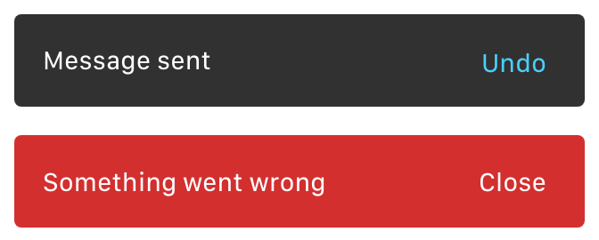

# React Awesome Toasts

Easily customizable React notification system that manages its queue for you.

<p align="center">Check out the <a href="https://jannikwibker.github.io/react-awesome-toasts/">demo page</a> - Fork of <a href="https://github.com/blvdmitry/react-awesome-toasts">blvdmitry/react-awesome-toasts</a></p>



- 🎙 Screen reader accessibility
- 🔧 Server side rendering support
- 📱 Responsive
- 📘 Typescript support
- 📦 React is the only dependency
- 🎉 6kb gzipped

## Get started

Install the package:

```sh
npm install @jannnik/react-awesome-toasts
// or
yarn add @jannnik/react-awesome-toasts
```

Wrap your app with `ToastProvider`:

```tsx
import { ToastProvider } from '@jannnik/react-awesome-toasts'

const App = () => (
  <ToastProvider>
    App content
  </ToastProvider>
)
```

The main idea is that you get a dispatch function (see [Hooks API reference - useReducer](https://reactjs.org/docs/hooks-reference.html#usereducer) or [understanding useReducer](https://alligator.io/react/usereducer/)) using which you can trigger events such as showing and removing toasts.

Instead of the dispatch function you can also use basic [helper functions](#helper-functions) which make the usage a bit more easy and enjoyable.


## Examples

You can either use the `with_toast` decorator or a `ToastConsumer` to get access to the dispatch function. Using the dispatch function can be done manually or through helper functions such as `show_toast` and `close_toast`.

*With High Order Component and dispatch function:*
 
```tsx
import { with_toast } from '@jannnik/react-awesome-toasts'

const ButtonWithToast = ({ dispatch }) => {
  const toast_props = {
    text: 'Message sent',
    action_text: 'Undo',
    aria_label: 'Message sent, click to undo',
    on_action_click: id => dispatch({ type: 'remove', payload: id }),
  }
  
  return <button onClick={() => dispatch({ type: 'show', payload: toast_props })}>Show toast</button>
}

export default with_toast(ButtonWithToast)
```

*With High Order Component and helper function:*
 
```tsx
import { with_toast } from '@jannnik/react-awesome-toasts'
import { show_toast, close_toast } from '@jannnik/react-awesome-toasts'

const ButtonWithToast = ({ dispatch }) => {
  const toast_props = {
    text: 'Message sent',
    action_text: 'Undo',
    aria_label: 'Message sent, click to undo',
    on_action_click: close_toast(dispatch)
  }
  
  // the default for on_action_click is dismissing/closing the toast, so it could be left out in this case
  return <button onClick={() => show_toast(dispatch, toast_props)}>Show toast</button>
}

export default with_toast(ButtonWithToast)
```

*With ToastConsumer:*

```tsx
import { ToastConsumer } from '@jannnik/react-awesome-toasts'
import { show_toast, close_toast } from '@jannnik/react-awesome-toasts'

const toast_props = {
  text: 'Message sent',
  action_text: 'Undo',
  aria_label: 'Message sent, click to undo',
}

const SomeComponent = () => (
  <ToastConsumer>
    {(dispatch: ToastContext) => (
      <button onClick={() => show_toast({ ...toast_props, on_action_click: close_toast })}>
        Show toast
      </button>    
    )}
  </ToastConsumer>
)
```

You can also use the `show_simple_toast` and `show_full_toast`.
- `show_simple_toast` assumes `on_action_click` wants to close the toast and that `text` and `aria_label` are the same.
- `show_full_toast` makes use of the ability to pass not only strings but also react elements as the `text`-property, it replaces newlines with `<br />`'s, assumes `on_action_click` wants to close the toast and allows specifying a variant of toast to show.


## Dispatch events

Since you get direct access to the dispatch function offered by `useReducer` some available events are mostly ment for internal use.

| Event                    | Payload     | Description                                                                            |
| ------------------------ | ----------- | -------------------------------------------------------------------------------------- |
| **`"show"`**             | toast props | Show a toast (or queue it when others are already being shown) using the given [toast props](#presentational-toast-component) (properties may be different when using a custom toast component) |
| **`"remove-and-queue"`** | toast id    | Remove the toast with the given id and queue a potentially waiting toast               |
| `"remove"` (*internal*)  | toast id    | Remove the toast with the given id without interacting with the queue (*used internally when the hiding animation ends as `"hide"` already queues a new toast*) |
| `"hide"` (*internal*)    | toast id    | Queue a potentially waiting toast (*used internally when the hiding animation starts*) |


## Presentational Toast component

By default `ToastProvider` uses the `Toast` component provided by the library.
The `Toast` component is responsible for the accessibility and responsiveness of notifications.
Keep in mind, that if your replace it with your custom component you will have to handle both of these features in your component if you need them in your app.

Default `Toast` component has follow properties:

| Property                                          | Description                        |
| ------------------------------------------------- | ---------------------------------- |
| text `string` or `(string | Element)[]`, required | Message to display in notification |
| action_text `string`                              | Text of the action button          |
| on_action_click `(id: string) => any`             | Action button click handler        |
| aria_label `string`                               | Default: `text` property value. Should be used for better accessibility. If `text` is not a string this property is required |
| variant `"error"`                                 | Variant of message                 |


## Customization

`ToastProvider` accepts properties for customizing the behaviour of the notifications.

| Property         | Description                                                            |
| ---------------- | ---------------------------------------------------------------------- |
| timeout `number` | Default: `4500`. The time until a toast is dismissed, in milliseconds. |
| component        | Presentational component for displaying notifications.                 |
| position `top-right, bottom-right, top-left, bottom-left, top-center, bottom-center` | Default: `bottom-left`. Position of the toasts on the screen. |

## Helper functions

There are 4 helper functions available: `show_toast`, `show_simple_toast`, `show_full_toast` and `close_toast`

### show_toast

```ts
const show_toast: (dispatch: ToastContext, payload: Props) => void
```

Show a toast using a dispatch function (`ToastContext`) and toast props.

### show_simple_toast

```ts
const show_simple_toast: (dispatch: ToastContext, text: string, action_text: string) => void
```

Show a toast using a dispatch function (`ToastContext`) and a `text` and `action_text` value.
The `aria_label` property of the normal toast props object is given by `text` and `on_action_click` closes the toast.

### show_full_toast

```ts
const show_full_toast: (dispatch: ToastContext, text: string, action_text: string, variant?: 'error' | undefined) => void
```

Show a toast using a dispatch function (`ToastContext`) and a `text`, an `action_text` and an optional `variant` value.
The `aria_label` property of the normal toast props object is given by `text`, `on_action_click` closes the toast and the `text` value is slightly transformed.

The `text` value is split by newlines and the resulting array is interleaved with `<br />` components in order to properly render newlines (this is done after `text` is used as the aria label).

### close_toast

```ts
const close_toast: (dispatch: ToastContext) => (id: string) => void
```

Given a dispatch function (`ToastContext`) and a toast id the specified toast is removed.


## Accessibility

Default presentational `Toast` component provides accessibility features:

- When toast is opened, action button gets focused if its present
- When toast is hidden, previous focus is restored
- When toast is shown, screen reader reads its message or `aria_label` value. Since action button gets focused automatically - it's nice to have an aria-label that mentions it, e.g. `"Item deleted, click to undo."`


## Roadmap

- Improve accessibility for focused toast actions
- Check colors AA accessibility level
